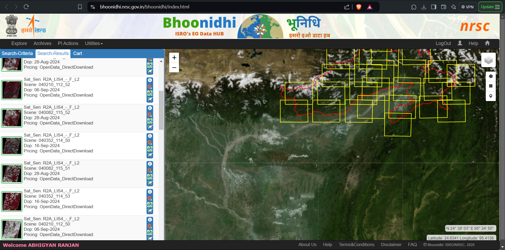
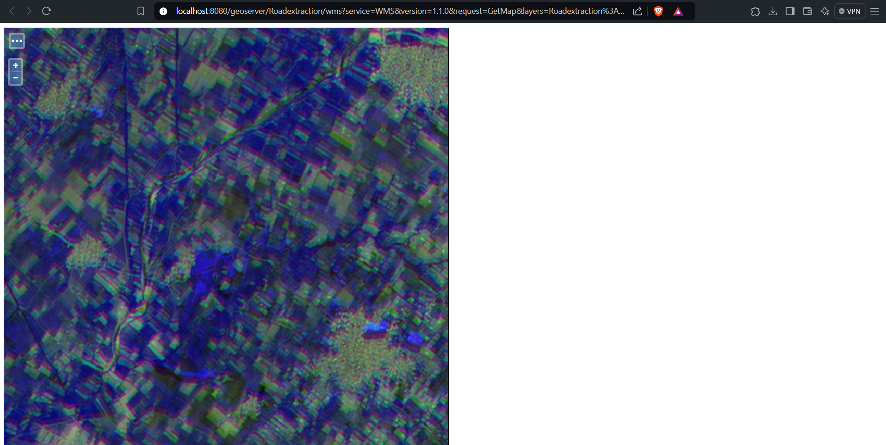
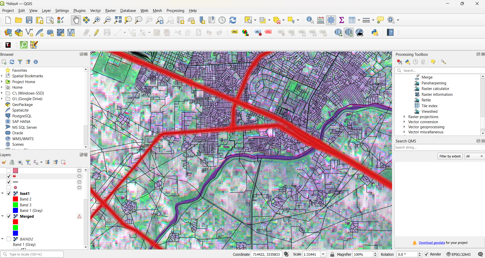

# Road Help Project

## Overview

The Road Help Project is a comprehensive solution for automatic road detection and mapping using LISS-4 satellite images. This project aims to facilitate the efficient mapping of road networks through machine learning techniques and advanced data processing methodologies. It encompasses various models, data pipelines, and visualization tools to enhance road network mapping and analysis.

## Images

### LISS-4 Satellite Image Source

This image illustrates the source from which LISS-4 satellite images were obtained for analysis and processing.

### GeoServer Generated Map

This image represents the map generated using the processed LISS-4 images through GeoServer, which enables the visualization and management of geospatial data.

### Road Shape Files Generated with QGIS

This image demonstrates how road shape files were generated over the LISS-4 satellite images using QGIS.

## Key Components

- **`.vscode/`**: Contains Visual Studio Code configurations to enhance the development experience.
- **`ML/`**: Directory for machine learning models utilized in road detection.
- **`notebooks/`**: Jupyter notebooks that provide a platform for model training, data processing, and analysis.
- **`src/`**: Source code that includes utilities, data pipelines, and component definitions.
- **`backend/`**: Contains the main application backend code for processing and serving requests.
- **`frontend/`**: The frontend application built with modern JavaScript frameworks and tools for user interaction.


## Installation

To set up the project, follow these steps:

1. Clone the repository:
   ```bash
   git clone <repository-url>
   
   cd <repository-directory>
---

